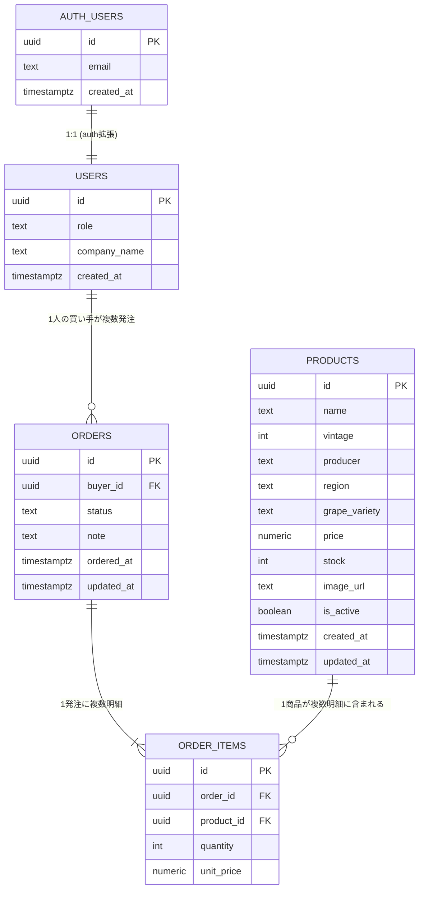

# ER図 - ワイン発注管理SaaS（MVP）

作成日: 2026-04-02
担当: db エージェント

---

## Mermaid ER 図



---

## テーブル説明

### auth.users（Supabase Auth 管理）
Supabase が自動で管理する認証ユーザーテーブル。直接操作はしない。

### public.users（プロファイル）
- `auth.users` の `id` を PK かつ FK として参照
- `role` が `'admin'` = 酒屋管理者、`'buyer'` = 飲食店
- RLS でロールごとにアクセス範囲を制御

### public.products（ワイン商品）
- 酒屋（admin）が登録・編集・削除
- `is_active = true` の商品のみ飲食店（buyer）から参照可能
- `updated_at` はトリガーで自動更新

### public.orders（発注ヘッダ）
- 飲食店（buyer）が作成。1回の発注につき1レコード
- `status` の遷移: `pending` → `confirmed` → `shipped` → `delivered`
- `updated_at` はトリガーで自動更新

### public.order_items（発注明細）
- `orders` に紐づく明細行
- `unit_price` は発注時の単価スナップショット（後から商品価格が変わっても保持）

---

## ステータス遷移図（orders.status）

```
pending（発注済み）
    ↓  admin が確認
confirmed（確認済み）
    ↓  admin が出荷
shipped（出荷済み）
    ↓  配達完了
delivered（配達済み）
```
