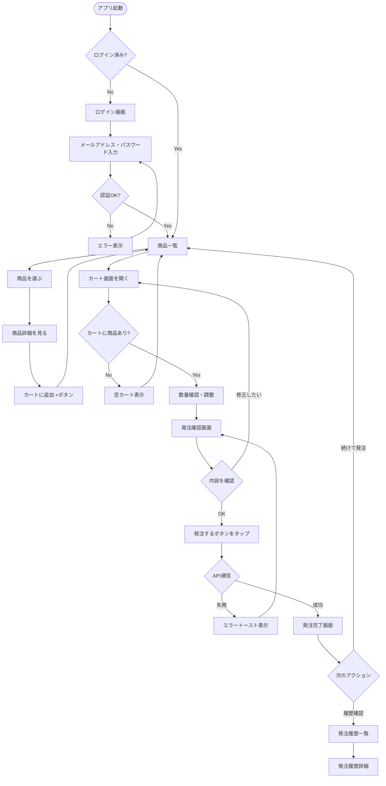
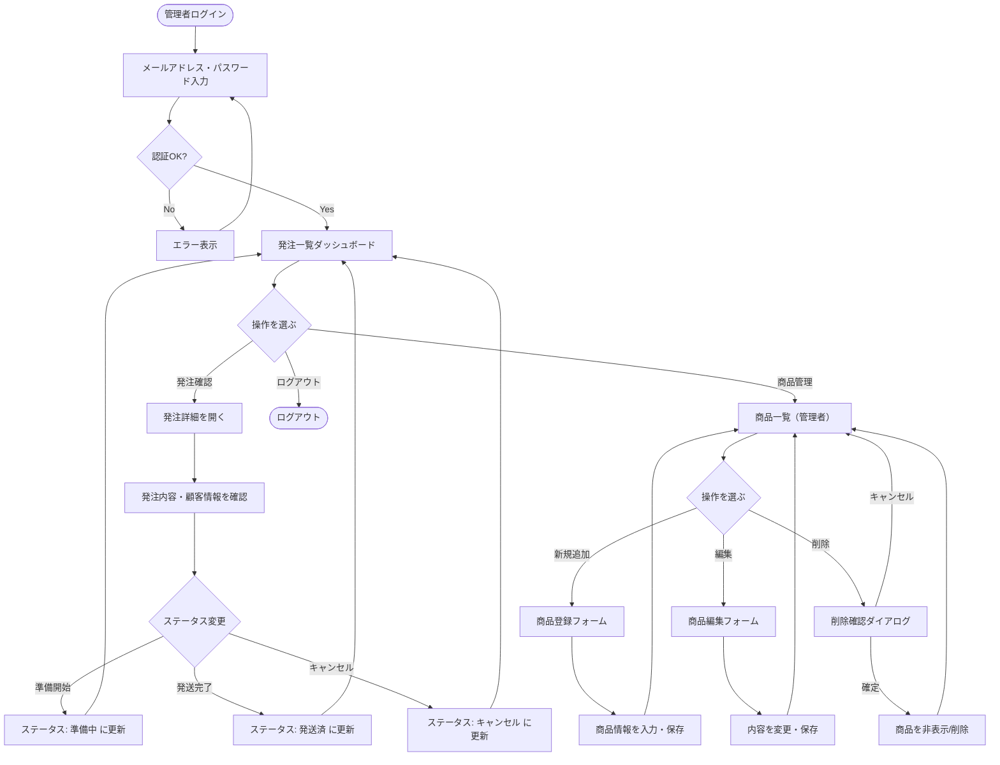
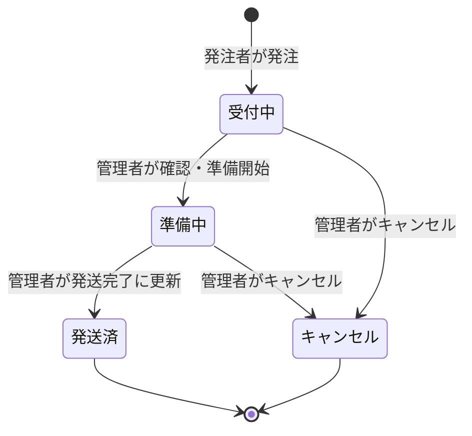

# ユーザーフロー - ワイン発注管理SaaS

作成日: 2026-04-02
担当: UI/UXデザイン

---

## 1. 発注者（飲食店スタッフ）のユーザーフロー

### フロー概要

発注者は主にスマホで操作する。忙しい営業前の時間に短時間で発注を完了できるよう、**3タップ以内での発注完了**を目標とする。

### テキスト記述

1. アプリを開く
2. ログイン（初回のみ・以降は自動ログイン）
3. 商品一覧を確認
4. 商品をカートに追加（+ボタンをタップ）
5. カートを確認・数量調整
6. 発注確認画面へ進む
7. 内容を確認して「発注する」をタップ
8. 発注完了画面が表示される
9. 必要に応じて発注履歴を確認

---

### Mermaid フロー図（発注者）



---

## 2. 管理者（酒屋）のユーザーフロー

### フロー概要

管理者はPCまたはiPadで操作する。発注の受付・ステータス管理・商品マスタの更新が主な業務。

### テキスト記述

1. ログイン（PCブラウザ）
2. ダッシュボード（発注一覧）を確認
3. 新着発注を確認
4. 発注詳細を開いてステータスを更新（準備中 → 発送済）
5. 必要に応じて商品を追加・編集

---

### Mermaid フロー図（管理者）



---

## 3. 画面遷移マップ

### 発注者（スマホ）

```
[ログイン]
    |
    v
[商品一覧] <---> [商品詳細]
    |                 |
    |           [カートに追加]
    |
    v
[カート画面]
    |
    v
[発注確認]
    |
    v
[発注完了]
    |
[発注履歴一覧] <---> [発注履歴詳細]
```

### 管理者（PC）

```
[ログイン]
    |
    v
[発注一覧（ダッシュボード）] <---> [発注詳細]
    |
[商品一覧（管理者）] <---> [商品登録・編集]
```

---

## 4. 状態遷移（発注ステータス）



---

## 5. 主要UXポイント

### 発注者向け

| ポイント | 設計方針 |
|----------|---------|
| ログイン省力化 | セッションを長期保持（30日）、再認証を最小化 |
| 商品探しやすさ | カテゴリフィルター＋テキスト検索を常に表示 |
| カート追加 | 商品一覧から直接「+」タップで追加（詳細画面を経由しなくてよい） |
| 発注確認 | 届け先・日時は事前設定済みのデフォルト値を使用 |
| エラー時の回復 | 通信エラー時は発注内容を保持しリトライ可能 |

### 管理者向け

| ポイント | 設計方針 |
|----------|---------|
| 新着発注の視認性 | ダッシュボード上部に新着発注をバッジ付きで表示 |
| ステータス更新 | ワンクリックでステータスを変更できるドロップダウン |
| 商品管理 | 発注一覧と商品一覧を独立したページで管理（サイドナビで切替） |
